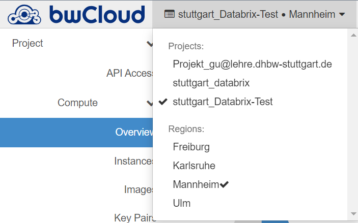

# bwCloud Dashboard

Mit dem bwCloud Dashboard können Sie alle Ressourcen Ihres Datarbrix-Projekts verwalten, einschließlich VMs, Storage Volumes und Netzwerkkonfigurationen.
Als Administrator sind Sie berechtigt, auf Databrix-Projekte in der bwCloud zuzugreifen. Dieser Abschnitt beschreibt, wie Sie sich in das Dashboard einloggen.

1.  Bitte loggen Sie sich zunächst in das bwCloud [Dashboard](https://portal.bw-cloud.org/project/) ein.
2.  Wählen Sie das Projekt Databrix-Test aus.
    
3.  Sie können jetzt alle Rechenressourcen in Ihrem Databrix-Test Projekt sehen und verwalten!