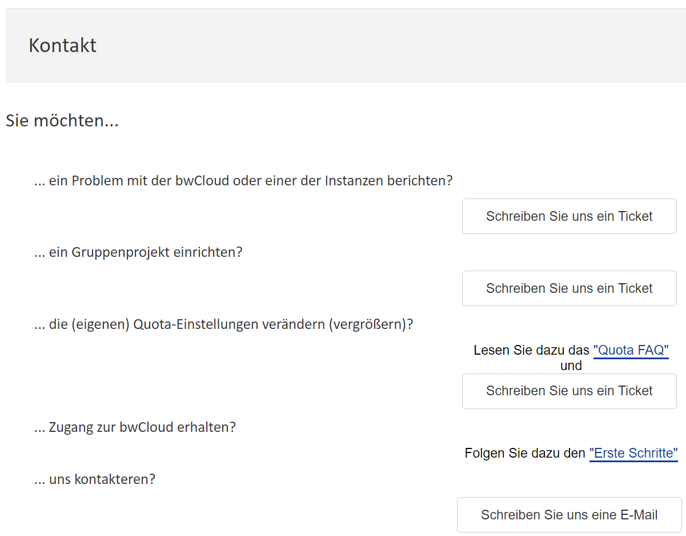
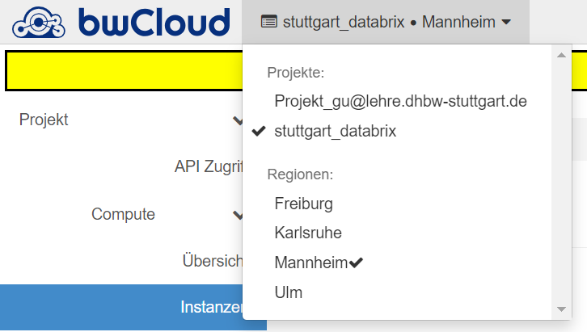

# Anfrage VM-Instanzen

Voraussetzung für die Anfrage ist, dass Sie ein bwCloud-Konto haben. Mit einem bwCloud-Konto können Sie nur eine VM mit einer vCPU und 1 GB RAM starten. Das ist für die meisten Projekte nicht genug. Daher müssen Sie bei den Mitarbeitern weitere Berechtigungen beantragen. Die folgenden Schritte helfen Ihnen bei der Anfrage nach weiteren VMs.

### Anmeldung in Dashboard bwCloud
Anmelden bei bwClouds Dashborad https://portal.bw-cloud.org/auth/login/

### Anfrage von VM
Oben rechts auf dem Dashboard steht Ihre E-Mail-Adresse. Klicken Sie auf Ihre E-Mail-Adresse und wählen Sie Hilfe.


Wählen Sie Kontaktformular im Feld Frage und Antwort.


Wählen Sie es, dass Sie ein Gruppen Projekt einrichten möchten, und schreiben Sie ein Ticket.


Bitte geben Sie im Ticket eine kurze Beschreibung Ihres Projekts an. Und beantragen Sie die benötigten VMs unter Verwendung des folgenden Formats. Derzeit kann bwCloud die folgenden Flavors anbieten. (Siehe https://www.bw-cloud.org/de/bwcloud_scope/flavors)
```js copy
SUBJECT: NEW_QUOTA 
MOTIVATION: TEXT (Warum Sie die Quota benötigen.)
USER_UUID: UUID (Ihre OpenStack User-UUID.)
PROJECT_UUID: UUID (Die existierende ziel (Gruppen-)Projekt UUID.)
NUMBER_VM: NUMMER 
RAM_GB: NUMMER 
VCPU: NUMMER 
MEMORY_GB: NUMMER 
FLAVORS: NAME, NAME (Welche(s) Flavor(s) möchten Sie nutzen.)
SPECIAL_QUOTA: TEXT (Welche Resourcen benötigen Sie.)
CUT_OFF_DATE: DD.MM.YYYY (Wie lange Sie die Resourcen benötigen.)
```

Sobald das Projekt genehmigt ist, sehen Sie Ihr neues Projekt in der oberen linken Ecke des Dashboards. In diesem Projekt haben Sie die Berechtigung, weitere VMs zu öffnen.
