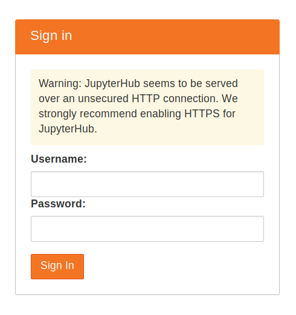

# Installation TLJH in VM von bwCloud

Jedes Team verwendet ein TLJH und ein VM. Wenn Sie also 10 Gruppen haben, sollten Sie die gleichen Installationsschritte auf 10 VMs wiederholen.

### SSH in Ihre VM
SSH in Ihre VM

### Installation TLJH
Stellen Sie sicher, dass Sie python3, python3-dev, curl und git installiert haben.
```js copy
sudo apt install python3 python3-dev git curl
```

Kopieren Sie den unten stehenden Text und fügen Sie ihn in das Terminal ein. Dieser Admin-Benutzer kann sich nach der Einrichtung des JupyterHub anmelden und ihn nach seinen Bedürfnissen konfigurieren.
```js copy
curl -L https://tljh.jupyter.org/bootstrap.py | sudo -E python3 - --admin Admin
```

Drücken Sie die Eingabetaste, um den Installationsvorgang zu starten. Der Vorgang dauert 5-10 Minuten. Nach Abschluss der Installation wird die Meldung Fertig! angezeigt.

### Einloggen in TLJH
Kopieren Sie die öffentliche IPv4 Adresse ihres Servers und versuchen Sie, von Ihrem Browser aus auf IPv4 zuzugreifen. Wenn alles gut gelaufen ist, sollten Sie nun eine Anmeldeseite für JupyterHub erhalten.


Melden Sie sich mit dem Benutzernamen „Admin“ an, den Sie in Schritt 3 eingestellt haben. Sie können ein beliebiges Passwort wählen. Verwenden Sie ein sicheres Passwort und notieren Sie es irgendwo, da dies von nun an das Passwort für das Admin-Benutzerkonto sein wird!

