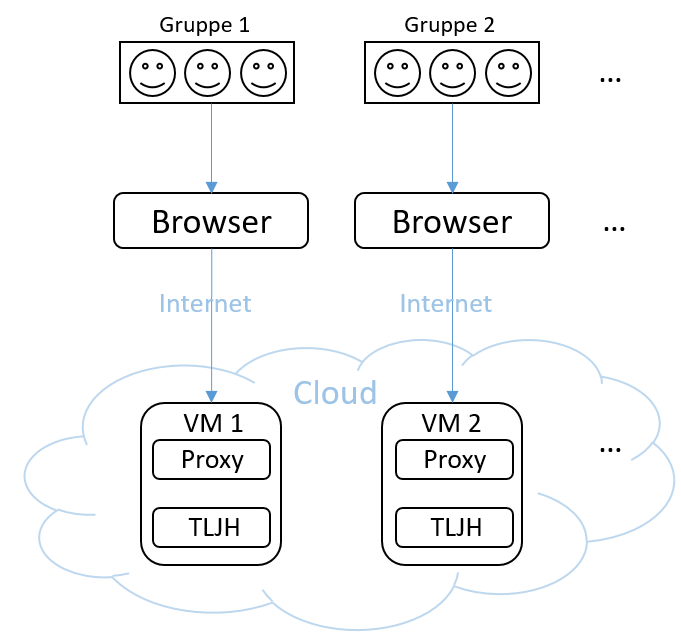
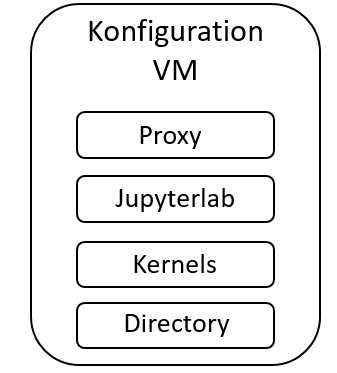

# Technische Dokumentation kollaborativer The Littlest Jupyterhub (TLJH) für Data Science Kurs von DHBW
  
Duale Hochschule Baden-Württemberg (DHBW) Stuttgart bietet einen angewandten Data Science Kurs an. Praktische Projekte können den Lernenden wertvolle Erfahrungen und analytische Denkweise vermitteln. The Littlest JupyterHub (TLJH) mit Amazon Web Service (AWS) und bwCloud werden verwendet für eine online Programmierumgebung. Weil es günstige und praktische Lösungen sind. Hier wird es in Details dokumentiert, wie der Plattform aufgebaut werden.

### Funktionsprinzip
Das untere Diagramm veranschaulicht das Funktionsprinzip des TLJH. Es zeigt, wie Studierenden die Programmierumgebung im Cloud über die verschiedenen Funktionseinheiten aus eigener Workstation nutzen können.

Die Studierenden können über ihre jeweiligen Browser, Workstation und das Internet auf virtuelle Maschinen in der Cloud zugreifen. Studierende, die der gleichen Gruppe angehören, greifen auf eine VM zu. Web-Agenten leiten ihre Anfragen an TLJH weiter und nutzen so eine gemeinsame Programmierumgebung. Hier können Studierende in derselben Gruppe in Echtzeit zusammenarbeiten und Notebooks gemeinsam nutzen.
Um die oben beschriebene Programmierumgebung zu schaffen, muss jede VM konfiguriert werden. Die folgende Abbildung zeigt die Komponenten, die konfiguriert werden müssen.

### Konfiguration von Virtueller Machinen (VM)
Bei Cloud-Anbietern gemietete VMs müssen oft weiter konfiguriert werden, um eine individuelle Programmierumgebung zu schaffen. Die folgende Abbildung zeigt die vier Module, die konfiguriert werden müssen. 

Richten Sie zunächst die Kommunikationsschnittstelle des Proxys so ein, dass Anfragen aus dem Netz an TLJH weitergeleitet werden. Als Nächstes richten Sie Jupyterlab so ein, dass er über Funktionen wie die Echtzeit-Kollaboration verfügt. Installieren Sie dann virtuelle Umgebungen für verschiedene Projekte. Erstellen Sie schließlich einen Ordner für die gemeinsame Nutzung von Dateien.
Mit den oben genannten Schritten können Sie die Konfiguration einer VM abschließen. Wenn Ihr Kurs zehn Gruppen hat, müssen Sie zehn VMs konfigurieren.
