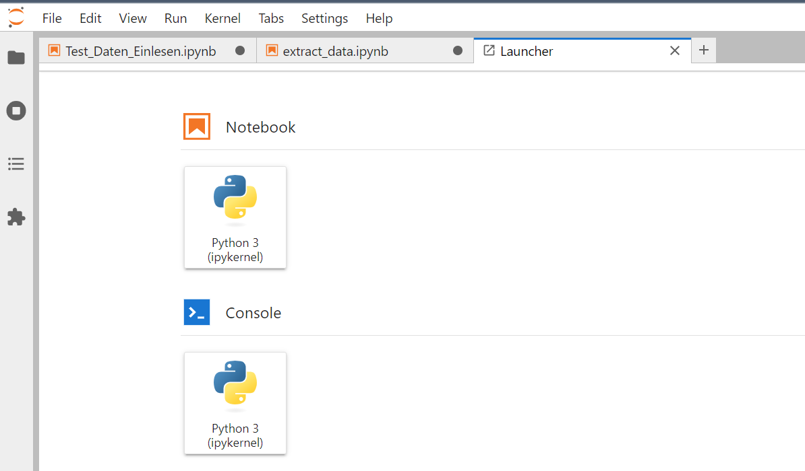

### Was ist TLJH?

TLJH ist eine kollaborative Version von Jupyterlab eingesetzt in Virtuelle Machine. AWS und bwCloud sind Cloud Anbieter. TLJH werden in seine Virtuelle Machine installiert.Verweigend wird Jupyterlab nach Installation automatisch lokal gehostet. User können durch z.B. http://localhost:8888/lab Jupyterlab benutzen. Gleich wie Jupyterlab, TLJH kann auch in Webseite deployed werden. Die Webseite kann zugänglich für alle sein, wer Internet und Browser haben. TLJH erstellt für jeden User ein Directory in der VM, welche als Workspace genannt wird. Virtuelle Environment und jupyterlab-extention können von Administrator eingelegt werden, welche jeder User verwenden dürfen. User können dann Dateien in eigne Directory hochladen und TLJH verwenden einfach wie Jupyterlab. 

TLJH ist eine Open-Source-Anwendung und kann daher auf virtuellen Maschinen von Cloud-Anbietern installiert werden.

### Teamarbeit in TLJH

Jede Gruppe mit drei bis vier Personen verwendet eine VM mit installiertem TLJH. Sie werden in einem bestimmten Zeitraum zusammenarbeiten, um die Projektaufgaben zu erledigen. Alle Studierenden entwickeln ihre Projekte gleichzeitig im selben gemeinsamen Arbeitsbereich. Dieser Ansatz nutzt die Rechenressourcen der VM voll aus und spart Zeit bei der Nutzung der VM. Dies ist den kostengünstigsten Ansatz für Hochschulen mit begrenzten Mitteln.
